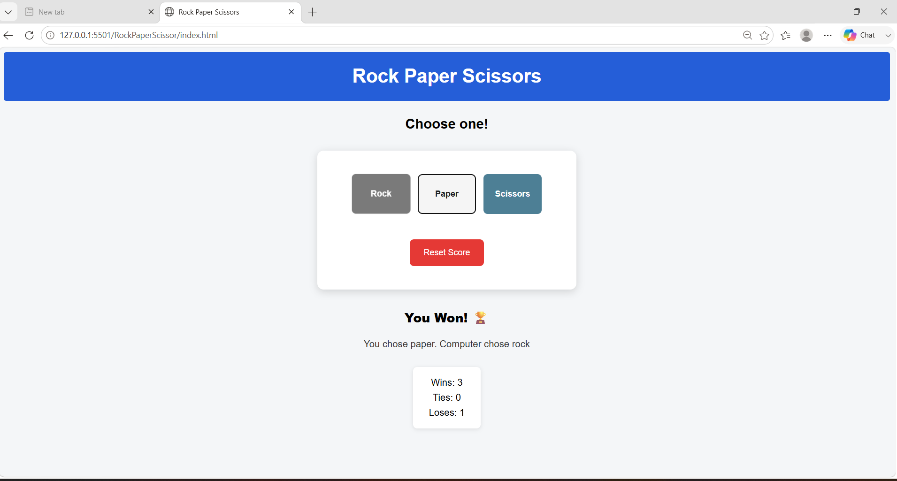

# Rock Paper Scissors Game

A simple interactive Rock Paper Scissors game built using HTML, CSS and JavaScript.

## Features

- Rock, Paper and Scissors gameplay
- Random computer choices
- Win, Tie and Loss tracking
- Score reset functionality
- Score saved using localStorage
- Interactive user interface

## Technologies Used

- HTML
- CSS
- JavaScript
- localStorage

## How to Play

1. Choose Rock, Paper or Scissors.
2. The computer randomly selects its choice.
3. The result is displayed on the screen.
4. The score is automatically updated.
5. Use the Reset Score button to start again.

## Screenshot



## Project Structure

```text
RockPaperScissors/
├── index.html
├── style.css
├── script.js
├── README.md
└── output.png
